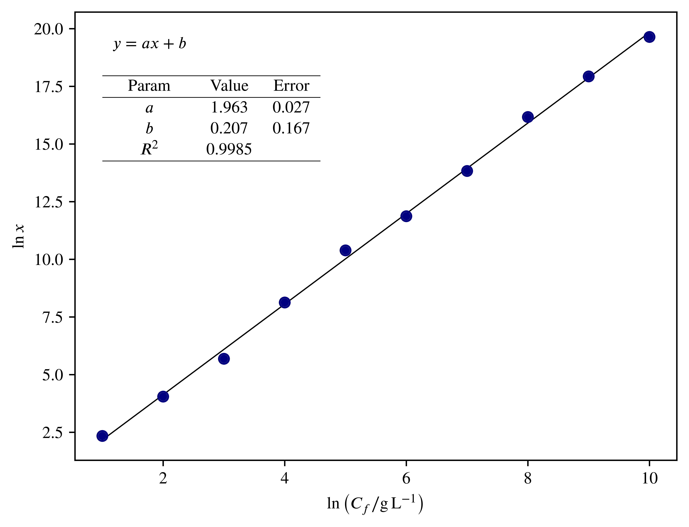

# Plotestrem


Small Python script for rapidly fitting data in the context of experimental sciences. With Plotestrem, you can easily fit (almost) any function and get a beautiful and scalable graphic. The axes are completely LaTeX-friendly, so you can use any packages you want. It also means you can use the same font as your main document.

For now, the equation is only generated for linear and exponential fitting, which should be sufficient for many applications. Maybe in the future I'll add more support.

This code is quite old, so it's not well-written, but it works.


## Usage

You'll need Python 3 installed and a LaTeX distribution. Then install the package:
```shell
pip3 install plotestrem
```

Once you have everything set up, open [`runner.py`](./runner.py), add your data and run.

Yeah, it have no interface. Maybe one day. Who knows.

### Fitting types
You can fit the data using three builtin fitters, or provide your own function. You just need to pass `fit_type` accordingly.

- `"linear"`: linear fit, will plot a line and show the parameters for the `y = a * x + b` equation;
- `"exp"`: exponential fit, will plot the exponential function and show the parameters for the `y = a * exp(-b * x) + c` equation;
- `"none"`: no fitting. It just skips the regression. Your data will be plotted as a scatter plot;
- Lastly, you can provide a function (a lambda or just the name of an existing function, without the parenthesis) to be used in the fitting. For now, the program won't show the parameters for user-defined functions, but this is an interesting feature to have in the future.

## Why _Plotestrem_?

It's how a *mineiro* (native of Minas Gerais -- Brasil) would say "Plot this thing". [Here](https://translate.google.com/?source=osdd&sl=pt&text=plota+esse+trem) you can listen a canonical speech, but it's not correct (as it's not *mineiro*). [This one](https://translate.google.com/?source=osdd&sl=pt&text=plótêss+trem) is a little better.

## Author

Developed by [Heliton Martins](https://t.me/helitonmrf).
